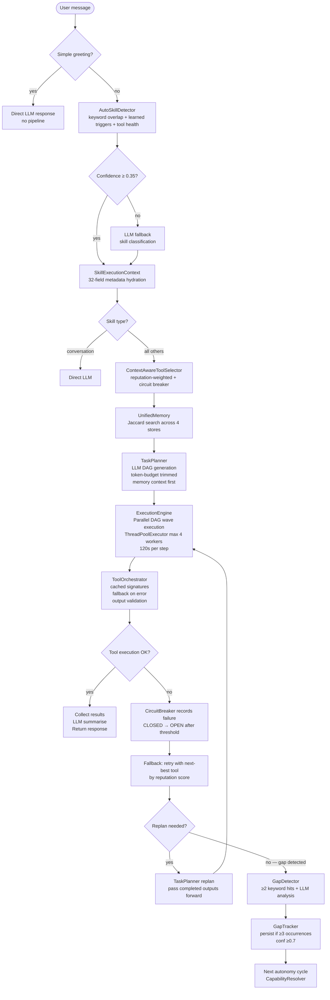
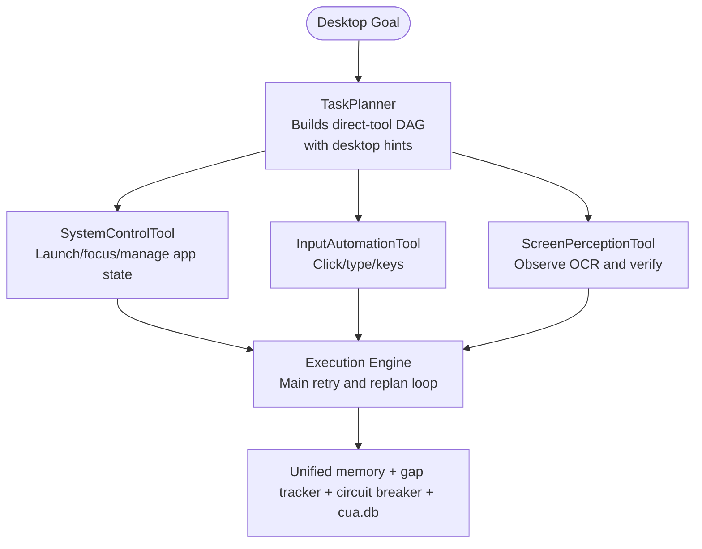
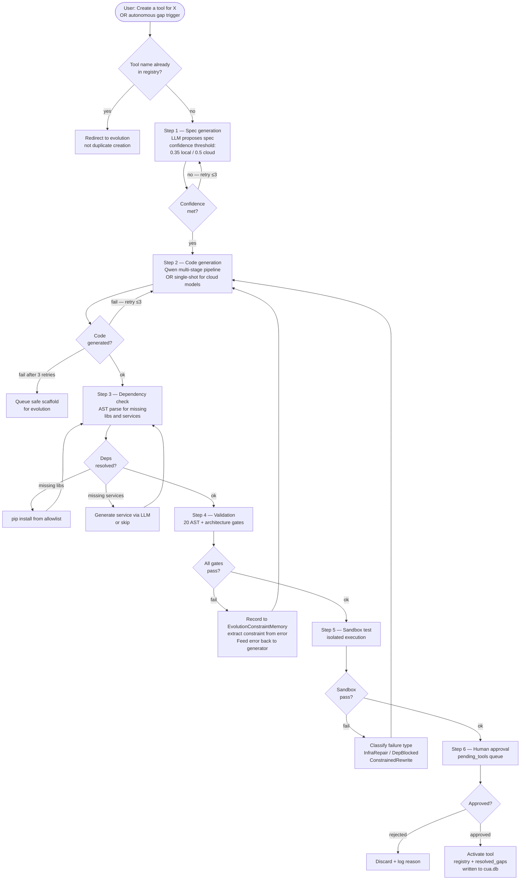
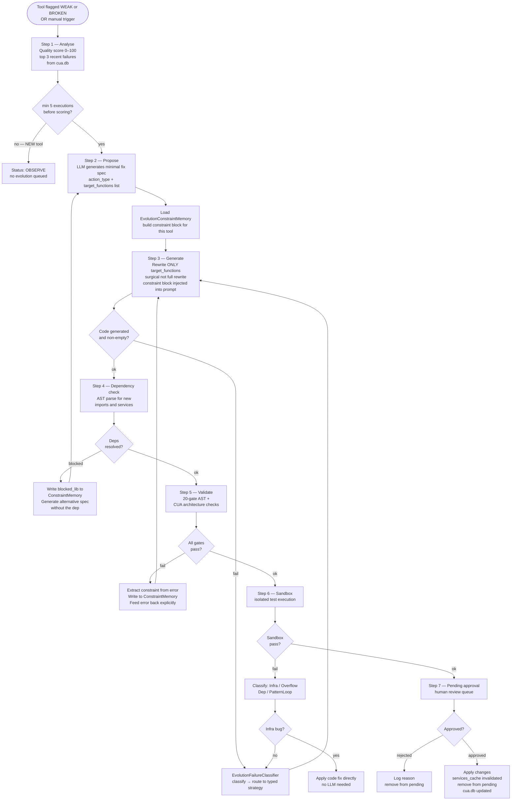
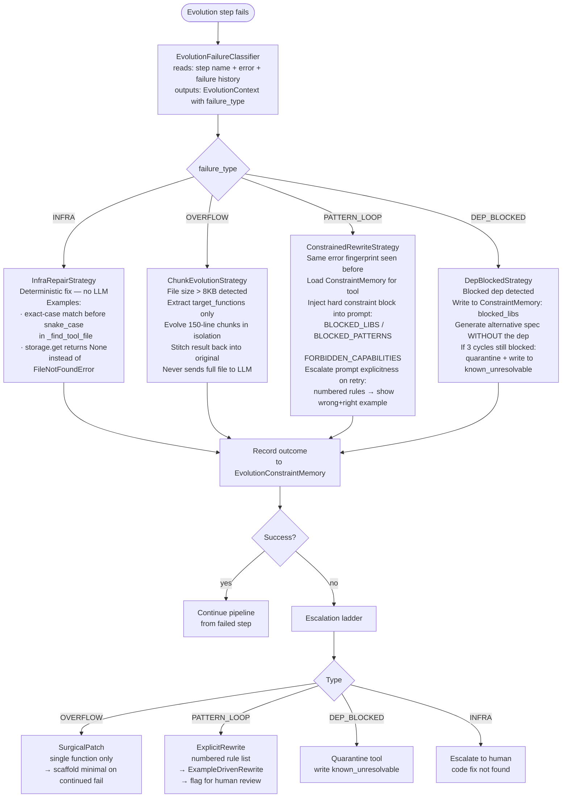
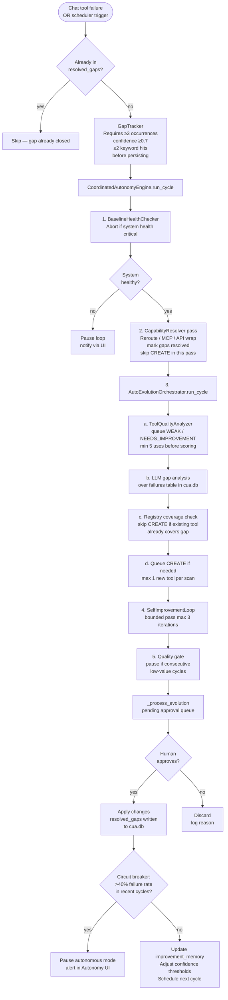
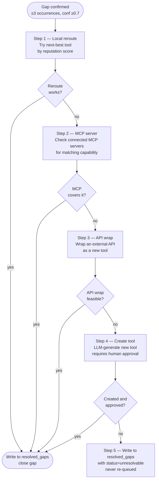
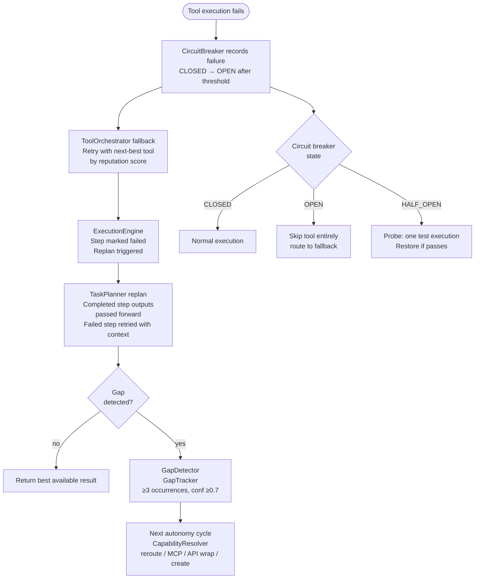

# Forge — Autonomous Agent Platform

> **A local-first, self-evolving autonomous agent platform with an Ollama-first runtime and optional cloud LLM providers.**
> Plans tasks, calls tools, detects capability gaps, generates new tools, and improves itself — all on your own hardware, with human approval gates at every critical step.
> **Now supports Qwen3.5 reasoning models with real-time thinking traces.**

---

## Table of contents

- [What Forge does](#what-forge-does)
- [Quick start](#quick-start)
- [Roadmap progress](#roadmap-progress)
- [System architecture](#system-architecture)
- [Request execution flow](#request-execution-flow)
- [Skill system](#skill-system)
- [Tool creation flow](#tool-creation-flow)
- [Tool evolution flow](#tool-evolution-flow)
- [Evolution failure strategy system](#evolution-failure-strategy-system)
- [Autonomous loop](#autonomous-loop)
- [Capability resolver](#capability-resolver)
- [Failure handling](#failure-handling)
- [Observability](#observability)
- [Security model](#security-model)
- [Available services](#available-services)
- [UI modes](#ui-modes)
- [Project structure](#project-structure)
- [Configuration](#configuration)
- [Testing](#testing)
- [Known gaps and limitations](#known-gaps-and-limitations)
- [Contributing](#contributing)

---

## What Forge does

Forge is an autonomous agent platform designed to run entirely offline on a local LLM. Desktop automation is one subsystem inside the platform, not the platform itself. It:

- **Plans and executes** multi-step tasks as parallel DAG waves
- **Supports slash-command operations** for runtime controls like `/status` and `/doctor`
- **Tracks workflow state persistently** so plans, approvals, and session work can be resumed
- **Gates commands through explicit session permissions** and supports review flows like `/review` and `/security-review`
- **Routes intelligently** via a 10-skill system with 3-signal scoring and LLM fallback
- **Calls tools natively** using function calling across 20+ tools
- **Searches codebases safely** with dedicated `GlobTool` and `GrepTool`
- **Perceives visually** through a layered vision and planning pipeline tuned for local execution
- **Detects capability gaps** when tools fail repeatedly and resolves them automatically
- **Generates and evolves tools** through LLM-driven pipelines with 20-gate AST validation
- **Repairs evolution failures** via a typed strategy system — infra bugs, context overflow, LLM pattern loops, and blocked dependencies each get a dedicated repair path
- **Manages dependencies** automatically — detects missing libraries and services via AST parsing
- **Self-improves** through a coordinated autonomy engine with bounded iteration and human approval gates
- **Observes everything** in a single consolidated SQLite database (`cua.db`, WAL mode)
- **Stores credentials securely** with Fernet encryption and per-tool access scoping
- **Connects to MCP servers** via JSON-RPC 2.0 with dynamic capability discovery

---

## Quick start

```bash
# 1. Install Ollama and pull a model
# Option A: Qwen3.5 9B (reasoning model with vision, faster)
ollama pull qwen3.5:9b

# Option B: Qwen 14B (pure code model, 8GB VRAM)
ollama pull qwen2.5-coder:14b

# 2. Install Python dependencies
pip install -r requirements.txt

# 3. Start the backend (port 8000)
python start.py

# 4. Start the UI (separate terminal, port 3000)
cd ui && npm install && npm start
```

- UI: `http://localhost:3000`
- API docs: `http://localhost:8000/docs`

**Windows:** Use `setup.bat` for first-time setup, then `start.bat` to run.

**Model Selection:** Qwen3.5:9b is the recommended local chat/planning model for vision-heavy tasks.

---

## Roadmap progress

### Claude Code adoption plan

Phase 1, Phase 2, Phase 3, Phase 4, Phase 5, Phase 6, Phase 7, Phase 8, Phase 9, Phase 10, and Phase 11 are complete.

Delivered:

- command registry skeleton in `application/commands/`
- `/status` and `/doctor` slash commands through the chat entry path
- `GlobTool` and `GrepTool` registered in the runtime and exposed to the planner
- persistent task artifacts for tracked workflow state and approval flows
- `/session`, `/summary`, `/export`, and `/resume` commands
- session summary/export/resume endpoints in the session router
- command-level permission checks at slash-command dispatch
- `/review`, `/security-review`, `/mcp`, and `/skills` commands
- read-only Forge MCP server mode with inspection tools for health, sessions, tasks, skills, executions, and observability
- explicit scoped memory notes for user and project context
- `/memory` and `/compact` slash commands for memory management and deterministic session compaction
- normalized diff payload generation for review flows and future approval/staging UI reuse
- session compaction endpoint in the session router
- shared diff viewer reuse across review chat output, approval diff modal, plan history detail, code preview, and staging preview
- `/worktree` slash command and worktree readiness service for future isolated git execution
- `/plan` and `/ultraplan` deep-planning commands that stage approval-gated execution plans
- `/memory maintain` plus a background memory maintenance loop for explicit note consolidation
- readiness-gated `/worktree create <label>` for bounded isolated git worktree provisioning
- `/worktree list` and `/worktree remove <label>` lifecycle commands plus worktree lifecycle API endpoints
- `/plan isolated <goal>` for approval-gated plans that prepare and persist a managed worktree profile
- session overlay controls for doctor, memory maintenance, session workflows, and worktree management
- chat welcome shortcuts for the highest-value planning and maintenance commands
- worktree-aware execution routing for bounded repo tools in isolated plans
- active task and approval UI visibility for isolated execution mode and worktree target
- persisted worktree lifecycle metadata plus cleanup recommendations for managed isolated worktrees
- isolation policy guidance that marks when worktree use is optional, suggested, or required during deep planning
- recent task history visibility for isolated execution context beyond the live task card
- reviewed worktree cleanup preview/apply flows for clean stale Forge-managed worktrees
- stronger `/plan` guidance that recommends `/plan isolated <goal>` when isolation is required and worktree preparation is available
- durable worktree lifecycle events in observability, session export payloads, and MCP summary counts
- bounded worktree handoff prototype with explicit owner, purpose, lease timing, and cleanup expectation
- worktree handoff API and slash-command flows for assign, release, and listing active handoffs
- unit coverage for command dispatch, search tools, task/session workflow services, review/runtime management commands, MCP server behavior, memory compaction, diff payload formatting, worktree readiness, deep planning, isolated planning, isolated execution routing, and maintenance flows

How this helps:

- diagnostics are faster and more predictable
- file discovery and content search are safer for the planner than shell-heavy fallback
- long-running work can now be inspected, exported, and resumed with its workflow state intact
- review and security inspection now have dedicated workflows instead of relying on ad-hoc prompts
- command execution now has a clearer safety boundary for future permission UX and governance
- Forge can now be inspected by other MCP-capable agents through a stable read-only server surface
- the extension story is cleaner because we now have an inspect-first integration seam before considering a broader plugin surface
- memory is now a first-class workflow surface instead of only internal session state
- long sessions can be compacted without losing the recent working set, which makes continuation safer
- diff-heavy workflows now have a reusable backend payload contract for future shared UI rendering
- diff-heavy workflows now also share a reusable frontend viewer, so review and approval surfaces stay aligned
- Forge can now report whether git worktree isolation is safe before we automate isolated coding flows
- operators can now explicitly request a deeper plan before execution instead of waiting for fallback planning
- explicit memory stores now have both manual and background consolidation paths
- isolated git work is now provisionable in a bounded way when the repository is ready
- prepared isolated plans now carry their worktree context through approval and task tracking
- runtime operations and worktree governance are now directly visible in the UI instead of being chat-only
- prepared isolated plans now execute bounded repo-facing tool steps inside their targeted worktree instead of only tracking that workspace as metadata
- operators can now see active isolated execution context directly in the task panel and approval surface
- managed worktrees now carry age, activity, and cleanup guidance so operators can review stale isolation assets safely
- deep plans now surface when isolation is recommended or required before execution begins
- recent task history now preserves and displays isolated execution context beyond the currently running task
- operators can now review cleanup candidates before removal and then apply cleanup through a bounded stale-worktree flow
- high-risk repo-wide plans now point directly at the safer isolated-plan follow-up command instead of only warning abstractly
- isolated worktree creation, routing, cleanup, and preparation now leave a durable event trail that can be inspected and exported with session history
- isolated work can now be explicitly handed off with a bounded ownership record instead of relying on informal operator memory

See `docs/CLAUDE_CODE_ADOPTION_PLAN.md` for the tracked roadmap.

---

## System architecture

```mermaid
graph TD
    User([User request])

    subgraph UI["UI — React (port 3000)"]
        Chat[Chat mode]
        ToolsMode[Tools mode]
        EvoMode[Evolution mode]
        AutonomyMode[Autonomy mode]
        ToolsMgmt[Tools management]
        Obs[Observability]
    end

    subgraph API["API layer — FastAPI (port 8000, 30+ routers)"]
        ChatAPI[/chat endpoint]
        CreationAPI[tool_creation_api]
        EvoAPI[tool_evolution_api]
        QualAPI[quality_api]
        ObsAPI[observability_api]
        AutAPI[autonomy_api]
        Bootstrap[bootstrap.py]
    end

    subgraph Core["Core engine"]
        SkillSel[SkillSelector\n3-signal scoring]
        SkillCtx[SkillExecutionContext\n32 fields]
        ToolSel[ContextAwareToolSelector\nreputation + circuit breaker]
        Memory[UnifiedMemory\nJaccard 4-store search]
        Planner[TaskPlanner\nLLM DAG + token budget]
        Exec[ExecutionEngine\nParallel DAG waves\nmax 4 workers]
        Orch[ToolOrchestrator\ncached signatures]
        CapRes[CapabilityResolver\n5-step chain]
    end

    subgraph ToolPipelines["Tool pipelines"]
        Creation[Tool creation\n6-step pipeline]
        Evolution[Tool evolution\n7-step pipeline]
        FailClass[EvolutionFailureClassifier\ntyped strategy routing]
        ConsMem[EvolutionConstraintMemory\nper-tool constraint profiles]
    end

    subgraph AutLoop["Autonomous loop"]
        BaseHealth[BaselineHealthChecker]
        GapTrack[GapTracker\n≥3 occurrences, conf ≥0.7]
        AutoEvo[AutoEvolutionOrchestrator]
        SelfImpr[SelfImprovementLoop\nmax 3 iterations]
        QGate[Quality gate\ncircuit breaker]
    end

    subgraph Tools["Tool registry"]
        Core2[Core tools\nFS · Web · HTTP · JSON · Shell]
        Exp[Experimental tools\nruntime-loaded]
        MCP[MCPAdapterTool\nper-server]
    end

    subgraph DB["Observability — cua.db (WAL)"]
        CUADB[(cua.db)]
    end

    User --> UI
    UI --> API
    API --> Core
    Core --> ToolPipelines
    Core --> AutLoop
    Core --> Tools
    Core --> DB
    ToolPipelines --> DB
    AutLoop --> DB
    FailClass --> ConsMem
    ConsMem --> DB
```

---

## Request execution flow



---

## Computer use orchestration

Desktop automation now stays on the same planner and execution path as the rest of the platform. The main planner composes the direct desktop tools into Observe -> Act -> Verify waves, so memory, gap tracking, circuit breaking, and `cua.db` persistence all remain shared.



**Key mechanisms:**
- **Direct-tool planning:** Desktop tasks are decomposed into normal planner steps instead of being handed to a nested controller.
- **State-aware verification:** `ScreenPerceptionTool` handles OCR and visual state checks so the executor can validate UI transitions like any other workflow.
- **Shared failure taxonomy:** Interactive failures surface structured categories such as `TIMING_ISSUE`, `ENVIRONMENT_CHANGED`, and `NO_EFFECT` for replanning.

---

## Skill system

Ten skills live in `skills/`, each with a `skill.json` and `SKILL.md`:

| Skill | Category | Preferred tools | Verification |
|-------|----------|-----------------|--------------|
| `web_research` | web | WebAccessTool, ContextSummarizerTool | source_backed |
| `computer_automation` | computer | FilesystemTool, ShellTool, SystemControlTool, InputAutomationTool, ScreenPerceptionTool | side_effect_observed |
| `code_analysis` | development | CodeAnalysisTool | output_validation |
| `code_workspace` | development | FilesystemTool, ShellTool | validation_and_tests |
| `conversation` | conversation | none | none |
| `browser_automation` | automation | BrowserAutomationTool, WebAccessTool | side_effect_observed |
| `data_operations` | data | HTTPTool, JSONTool, DatabaseQueryTool | output_validation |
| `finance_analysis` | finance | FinancialAnalysisTool | output_validation |
| `knowledge_management` | productivity | LocalCodeSnippetLibraryTool, LocalRunNoteTool | output_validation |
| `system_health` | system | SystemHealthTool | output_validation |

**Selection scoring (3 signals):**
1. Keyword overlap between request and skill keywords
2. Learned trigger patterns from `learned_patterns` table
3. Tool health — skills whose preferred tools have low health scores are down-ranked

If no skill reaches confidence `0.35`, the LLM classifies directly. The `conversation` skill short-circuits the full execution pipeline and goes straight to LLM response.

---

## Tool creation flow



**Key invariants:**
- Dependency check runs *before* validation — avoids running 20 gates on code with missing imports
- Duplicate check at entry — redirects to evolution if tool name exists
- 3-retry cap with scaffold fallback — prevents infinite generation loops
- Constraint memory — validation errors are persisted and injected into all future prompts for this tool

---

## Tool evolution flow



**Key invariants:**
- Evolution is **surgical** — `target_functions` scopes rewrites to only the functions that need changing
- Tools with fewer than 5 executions are never scored — prevents false BROKEN flags on new tools
- `EvolutionConstraintMemory` is loaded at Step 3 — constraints accumulated from all prior failures are injected into every generation prompt, preventing the LLM from repeating the same mistake
- Step numbering is 1–7 (not 1–6 with a "step 3.5") — dependency check is a proper numbered step

---

## Evolution failure strategy system

The evolution pipeline uses a typed failure classifier to route each failure to the right repair strategy. This prevents whack-a-mole: four distinct failure modes each have a dedicated handler instead of all being retried with the same prompt.



**EvolutionConstraintMemory — per-tool constraint profile (persisted in `cua.db`):**

| Field | What it stores | Effect |
|-------|---------------|--------|
| `blocked_libs` | `["pandas", ...]` | Injected into all future proposals — LLM told not to use them |
| `blocked_patterns` | `["example.com", "ThreadPoolExecutor()"]` | Added on validation fail |
| `forbidden_capabilities` | `["analyze_task"]` | Duplicate caps never re-registered |
| `max_chunk_lines` | `200` | Set when context overflow detected |
| `require_target_functions` | `true` | Large tools always get scoped rewrites |
| `last_successful_strategy` | `"ChunkEvolutionStrategy"` | Router preference on next cycle |

**Failure type classification rules:**

| Type | Detected when | Strategy |
|------|--------------|----------|
| `INFRA` | `step=analysis` + "Could not analyze", or `FileNotFoundError` in storage | `InfraRepairStrategy` — code fix, no LLM |
| `OVERFLOW` | `step=code_generation` + empty output + file size > 8KB | `ChunkEvolutionStrategy` — 150-line chunks |
| `PATTERN_LOOP` | Same `step:error` fingerprint seen in prior attempts | `ConstrainedRewriteStrategy` — constraint injection |
| `DEP_BLOCKED` | "dependency" or "not available" in error | `DepBlockedStrategy` — alternative spec generation |

---

## Autonomous loop



**Autonomy guarantees:**

| Guarantee | Mechanism |
|-----------|-----------|
| No infinite tool creation | `max_new_tools_per_scan=1` + registry coverage check before CREATE |
| No duplicate gaps | `resolved_gaps` table + `resolution_attempted` filter in GapTracker |
| No runaway evolution | `enable_enhancements=False` — only WEAK/NEEDS_IMPROVEMENT tools queued |
| No low-usage churn | `min_usage=5` — tools with fewer than 5 executions never analysed |
| No false-positive gaps | ≥2 keyword hits + ≥3 occurrences + confidence ≥0.7 required |
| No unapproved code runs | Every create/evolve/improve goes through human approval gate |
| Bounded improvement | `improvement_iterations_per_cycle=3` hard cap |
| Bounded evolution | `max_evolutions_per_cycle=2` hard cap |
| Circuit breaker | Loop pauses if recent failure rate > 40% |

---

## Capability resolver

When a confirmed gap can't be closed by evolution, the resolver escalates through five steps and exits as soon as one succeeds:



---

## Failure handling



---

## Observability

All data lives in `data/cua.db` — single WAL-mode SQLite database.

**Key tables:**
- `executions` — tool execution history and timing
- `conversations` — chat messages and session state
- `evolution_runs` / `evolution_artifacts` — evolution attempts and per-step artifacts
- `tool_creations` / `creation_artifacts` — tool creation attempts and per-step artifacts
- `failures` / `risk_weights` — failed changes and error patterns
- `learned_patterns` — skill trigger patterns
- `resolved_gaps` — capability gaps resolved
- `evolution_constraints` — per-tool constraint profiles
- `plan_history` — execution plan history
- `tool_metrics_hourly` / `system_metrics_hourly` — performance metrics

**UI access:** Full database viewer in Observability mode with pagination, filters, and row details.

---

## Security model

**Shell access** — `ShellTool` enforces a command allowlist. Generated code cannot bypass this because dangerous patterns (`subprocess.*`, `os.system`, `eval`, `exec`, `__import__`) are AST-blocked at validation. All shell access must go through `self.services.shell.execute(command)`.

**Human approval gates** — no generated code runs without explicit approval. All tool creation, evolution, and self-improvement changes queue for human review.

**Sandbox isolation** — all generated code executes in an isolated sandbox before approval.

**Protected core files** — core system files are immutable regardless of LLM output.

**Credential isolation** — Fernet-encrypted store with per-tool access scoping.

**Package allowlist** — only curated packages can be installed. Hallucinated or typosquatted names are rejected.

---

## Available services

Tools access the runtime via `self.services.*`:

```python
# Storage — auto-scoped to tool
self.services.storage.save(id, data)
self.services.storage.get(id)
self.services.storage.list(limit=10)
self.services.storage.update(id, updates)
self.services.storage.delete(id)

# LLM
self.services.llm.generate(prompt, temperature, max_tokens)

# HTTP
self.services.http.get(url)
self.services.http.post(url, data)

# Filesystem
self.services.fs.read(path)
self.services.fs.write(path, content)

# JSON
self.services.json.parse(text)
self.services.json.stringify(data)

# Shell — allowlist enforced
self.services.shell.execute(command)

# Logging
self.services.logging.info(message)
self.services.logging.error(message)

# Credentials — per-tool scoped
self.services.credentials.get(key)
self.services.credentials.set(key, value, allowed_tools)

# Inter-tool communication
self.services.call_tool(tool_name, operation, **parameters)
self.services.list_tools()
self.services.has_capability(capability_name)
```

---

## Tools

### Core (always loaded)

| Tool | Capabilities |
|------|-------------|
| `FilesystemTool` | read, write, list files and directories |
| `GlobTool` | sandboxed file discovery with glob patterns |
| `GrepTool` | sandboxed content search across files |
| `WebAccessTool` | fetch URLs, search the web, crawl, extract links |
| `HTTPTool` | GET, POST, PUT, DELETE with domain allowlist |
| `JSONTool` | parse, stringify, query |
| `ShellTool` | execute commands via allowlist |

### Experimental (runtime-loaded from `tools/experimental/`)

| Tool | Capabilities |
|------|-------------|
| `ContextSummarizerTool` | summarise text, extract key points, sentiment |
| `DatabaseQueryTool` | query cua.db, analyse tool performance |
| `BrowserAutomationTool` | navigate, screenshot, find elements |
| `LocalCodeSnippetLibraryTool` | save, get, search code snippets |
| `LocalRunNoteTool` | note management |
| `BenchmarkRunnerTool` | run benchmark suites |
| `FinancialAnalysisTool` | stock data, mutual funds, portfolio analysis |
| `MCPAdapterTool` | call MCP tools (one instance per server) |

---

## UI modes

| Mode | Purpose |
|------|---------|
| **Chat** | Conversational interface, native tool calling, agentic responses |
| **Tools mode** | Tool creation, capability spec, sandbox testing, approval workflow |
| **Evolution mode** | Tool selection, evolution workflow, pending approvals, capability gaps, auto-evolution, pending services |
| **Autonomy mode** | Agent cockpit: live cycle pipeline, thought stream (WebSocket), gap kanban, cycle history, start/stop/run-cycle controls, pending approvals banner, evolution queue strip, circuit breaker status |
| **Tools management** | Health dashboard, search/filter, LLM analysis, code viewer |
| **Observability** | Full-page `cua.db` viewer, paginated data, row details, column filters |

---

## Project structure

```
Forge/
├── api/                              # FastAPI routers (30+ files)
│   ├── server.py                     # Main server + /chat endpoint
│   ├── bootstrap.py                  # Runtime init + router wiring
│   ├── chat_helpers.py               # Chat handler, gap recording, tool execution
│   └── *_api.py                      # Feature routers
│
├── application/                      # Main use cases and services (see also domain/ and infrastructure/)
│   ├── skills/                       # Skill system
│   │   ├── selector.py               # 3-signal scoring + LLM fallback
│   │   ├── execution_context.py      # SkillExecutionContext (32 fields)
│   │   ├── context_hydrator.py       # Skill → execution context
│   │   └── tool_selector.py          # ContextAwareToolSelector
│   │
│   ├── tool_creation/                # 6-step creation pipeline
│   │   ├── flow.py                   # Pipeline orchestrator
│   │   ├── spec_generator.py         # LLM spec generation
│   │   ├── code_generator/
│   │   │   ├── qwen_generator.py     # Multi-stage (local models)
│   │   │   └── default_generator.py  # Single-shot (cloud models)
│   │   ├── validator.py              # 20-gate AST validator
│   │   └── sandbox_runner.py         # Isolated test execution
│   │
│   ├── tool_evolution/               # 7-step evolution pipeline
│   │   ├── flow.py                   # Pipeline orchestrator
│   │   ├── analyzer.py               # Tool analysis + health scoring
│   │   ├── proposal_generator.py     # LLM proposals + target_functions
│   │   ├── code_generator.py         # Surgical rewrite
│   │   ├── validator.py              # 20-gate AST validator
│   │   ├── sandbox_runner.py         # Isolated test execution
│   │   ├── failure_classifier.py     # EvolutionFailureClassifier
│   │   └── strategies/               # Typed repair strategies
│   │       ├── infra_repair.py       # Type A — deterministic fixes
│   │       ├── chunk_strategy.py     # Type B — 150-line chunking
│   │       ├── constrained_rewrite.py # Type C — constraint injection
│   │       └── dep_blocked.py        # Type D — alternative spec
│   │
│   ├── autonomous_agent.py
│   ├── task_planner.py               # Token-budget trimming, memory context first
│   ├── execution_engine.py           # Parallel DAG wave execution
│   ├── tool_orchestrator.py          # Cached signatures, services_cache invalidation
│   ├── strategic_memory.py           # Jaccard + win-rate + recency decay
│   ├── unified_memory.py             # 4-store search facade
│   ├── capability_resolver.py        # 5-step resolution chain
│   ├── capability_mapper.py          # Scans tools/ + tools/experimental/
│   ├── gap_detector.py               # ≥2 keyword hits, LLM gap analysis
│   ├── gap_tracker.py                # Persistence, resolution_attempted filter
│   ├── evolution_constraint_memory.py # Per-tool constraint profiles
│   ├── auto_evolution_orchestrator.py
│   ├── coordinated_autonomy_engine.py
│   ├── credential_store.py           # Fernet encryption, TTL support
│   ├── circuit_breaker.py            # Thread-safe CLOSED→OPEN→HALF_OPEN
│   ├── cua_db.py                     # Single WAL-mode SQLite, 21 tables
│   └── config_manager.py             # Config + startup validator
│
├── tools/                            # Tool implementations
│   ├── enhanced_filesystem_tool.py
│   ├── web_access_tool.py
│   ├── http_tool.py
│   ├── json_tool.py
│   ├── shell_tool.py
│   └── experimental/                 # Runtime-loaded auto-generated tools
│
├── skills/                           # 10 skill definitions (skill.json + SKILL.md each)
│
├── planner/
│   ├── llm_client.py                 # LLM interface, timeout + retry
│   └── tool_calling.py               # Native function calling, multi-round
│
├── updater/                          # Self-improvement update pipeline
│   ├── orchestrator.py
│   ├── risk_scorer.py
│   ├── sandbox_runner.py
│   ├── update_gate.py
│   ├── atomic_applier.py
│   └── audit_logger.py
│
├── tests/
│   ├── unit/                         # Per-component unit tests
│   ├── integration/                  # Full pipeline tests
│   ├── smoke/                        # Boot and approval flow
│   ├── experimental/                 # Per experimental tool tests
│   └── conftest.py
│
├── docs/
│   ├── ARCHITECTURE.md               # Architecture deep-dive
│   ├── OBSERVABILITY.md              # Observability guide
│   ├── SYSTEM_ARCHITECTURE.md        # Runtime and orchestration overview
│   ├── COMPUTER_USE_TOOLS.md         # Desktop automation subsystem
│   └── TOOL_CREATION_FLOW_EXPLAINED.md
│
├── ui/src/components/                # React UI (50+ components)
│
├── config.yaml                       # MCP servers, resolver catalogues
├── config/model_capabilities.json    # Per-model strategy, max_lines, min_confidence
├── requirements.txt
├── start.py
├── setup.bat / start.bat             # Windows helpers
└── data/
    ├── cua.db                        # Single consolidated database (WAL)
    ├── capability_gaps.json
    ├── strategic_memory.json
    ├── credentials.enc
    └── pending_*.json
```

---

## Configuration

**Environment variables:**

| Variable | Default | Description |
|----------|---------|-------------|
| `OLLAMA_URL` | `http://localhost:11434` | Ollama server URL |
| `CUA_API_URL` | `http://localhost:8000` | Backend base URL |
| `CORS_ALLOW_ORIGINS` | `http://localhost:3000` | Allowed CORS origins |
| `REACT_APP_API_URL` | — | Frontend → backend URL |
| `REACT_APP_WS_URL` | — | Frontend WebSocket URL |
| `CUA_RELOAD_MODE` | — | Set to `1` to disable coordinated autonomy (use with `uvicorn --reload`) |

All variables are validated on startup — missing required config fails fast with a clear error message.

**Config files:**
- `config.yaml` — MCP servers, capability resolver catalogues
- `config/model_capabilities.json` — per-model strategy and thresholds
- `requirements.txt` / `ui/package.json` — dependencies

**Model-aware thresholds:**

| Model type | Confidence threshold | Code generation strategy | Special features |
|-----------|---------------------|--------------------------|------------------|
| Local (Qwen, Mistral) | 0.35 | Qwen multi-stage pipeline | — |
| Reasoning (Qwen3.5) | 0.35 | Qwen multi-stage pipeline | Thinking traces, vision support |
| Cloud (GPT, Claude, Gemini) | 0.50 | Single-shot generation | — |

**Reasoning Models:** Qwen3.5 and similar reasoning models output to a "thinking" field instead of "response" field. The system automatically detects and extracts from the correct field.

---

## Testing

```bash
pytest -q
```

| Suite | Location | Coverage |
|-------|----------|----------|
| Unit | `tests/unit/` | Per-component |
| Integration | `tests/integration/` | Full pipeline |
| Smoke | `tests/smoke/` | Boot and approval flow |
| Experimental | `tests/experimental/` | Per experimental tool |


---

## Known gaps and limitations

| Area | Issue |
|------|-------|
| `CircuitBreaker` | Uses cumulative failure count, not a sliding window |
| `ImprovementMemory` | Still writes to separate `improvement_memory.db` instead of `cua.db` |
| `SkillSelector` | No strong negative signal between competing skills |
| `TaskPlanner` | Replan on retry may not carry completed outputs forward correctly |
| Parallel execution | `max_workers=4` tuned for cloud LLMs — reduce to 1–2 for single-GPU setups |
| Strategic memory | Jaccard similarity is keyword-based, not semantic |
| Evolution constraints | No TTL or cleanup policy for stale constraints |

---

## Contributing

1. Pass `SkillExecutionContext` wherever execution happens
2. Track steps with `execution_context.add_step()` and errors with `execution_context.add_error()`
3. New runtime services usually start in `infrastructure/services/` and then get wired into the tool service facade.
4. New DB tables belong under `infrastructure/persistence/sqlite/` and any affected tools or APIs should be updated in the same change.
5. New MCP servers go in `config.yaml` under `mcp_servers`.
6. New evolution failure types should update the classifier and the matching strategy implementation together.
7. Keep tools parallel-safe: avoid shared mutable state unless it is explicitly coordinated.

---

## License

MIT License — see LICENSE file

---

## Acknowledgements

- **Qwen / Alibaba Cloud** — primary local code generation model
- **Ollama** — local LLM hosting
- **FastAPI** — backend framework
- **React** — frontend framework
